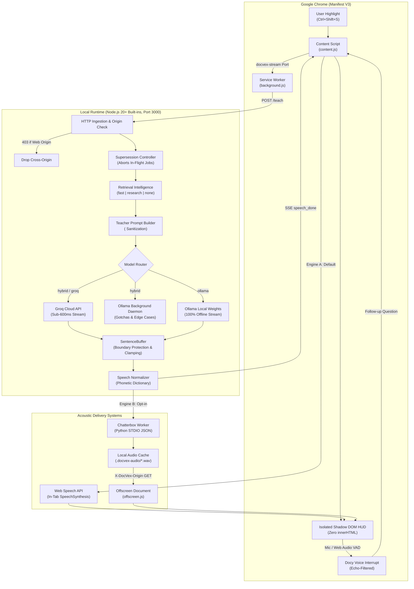

<div align="center">

# DOCVEX

### ❝ Hear your documentation. ❞

` ▂ ▃ ▅ ▆ ▇ █ ▇ ▆ ▅ ▃ ▂   ACOUSTIC TECHNICAL TUTOR   ▂ ▃ ▅ ▆ ▇ █ ▇ ▆ ▅ ▃ ▂ `

<br/>

[](https://opensource.org/licenses/MIT)
[](https://nodejs.org/)
[](extension/manifest.json)
[-00C853?style=for-the-badge&logo=checkmarx&logoColor=white)](server/test/)
[](package.json)
[](server/config.js)

<br/>

**DocVex** is an offline-first acoustic learning engine for developers. It binds a Manifest V3 browser extension to a zero-dependency local Node.js runtime, converting highlighted code, algorithms, and technical documentation into spoken, spatial mental models in real time.

</div>

---

## ⚡ Technical Highlights

```text
┌─────────────────┐     ┌─────────────────────┐     ┌──────────────────────┐
│  AUDIO STREAM   │     │   LOCAL INFERENCE   │     │   LATENCY ENVELOPE   │
│ Web Speech API  │     │ Ollama (qwen3:4b)   │     │  < 600ms Time To     │
│ + Chatterbox WAV│     │ 100% On-Device      │     │  First Sentence      │
└─────────────────┘     └─────────────────────┘     └──────────────────────┘
┌─────────────────┐     ┌─────────────────────┐     ┌──────────────────────┐
│  DOC GROUNDING  │     │   VOICE INTERRUPT   │     │   SECURITY BOUNDARY  │
│ 23 Authoritative│     │ Web Audio VAD +     │     │ Zero NPM Runtime Deps│
│ Domain Allowlists│    │ Bilingual Wake Words│     │ Strict Zero-innerHTML│
└─────────────────┘     └─────────────────────┘     └──────────────────────┘
```

- **Spatial Mental Cinema**: Translates algorithms into physical spatial mechanics (e.g., sliding windows as movable optical apertures, arrays as indexed storage lockers) with concrete dry-runs.
- **Phonetic Normalization**: Live regex phonetics compiler transforms syntax into natural spoken language (`O(n log n)` ➔ *"order of n log n"*, `arr[i] !== x` ➔ *"array at index i is not equal to x"*).
- **Streaming Sentence Buffer**: Splits SSE token streams at clause boundaries (clamped to $\le 360$ chars), protects decimals and abbreviations (`3.14`, `e.g.`), and schedules paragraph-level acoustic pauses ($1000\text{ms}$).
- **Bilingual Voice Interrupt (Docy)**: Real-time microphone listener with acoustic self-echo rejection detecting English and Hindi wake words (`wait`, `listen`, `ruko`, `ruk ja bhai`, `doubt`) to pause playback and handle spontaneous voice questions.
- **Provider Tri-Routing**:
  - `ollama`: $100\%$ air-gapped, on-device inference using local GGUF models.
  - `groq`: Ultra-low latency cloud streaming with automatic exponential backoff retry.
  - `hybrid`: Groq streams spoken audio instantly while local Ollama computes background architectural gotchas and pitfalls concurrently.

---

## 📐 Architecture



---

## 🔊 The Speech Pipeline

DocVex bridges raw code syntax and acoustic comprehension through a multi-stage streaming pipeline:

```text
  INPUT TOKEN STREAM (Ollama / Groq SSE)
           │
           ▼
  ┌─────────────────────────────────────────────────────────┐
  │ 1. SentenceBuffer Accumulator                           │
  │    • Boundary protection: ignores dots in decimals      │
  │      ("3.14") and abbreviations ("e.g.", "i.e.", "vs.") │
  │    • Clause clamping: splits long sentences (>360 chars)│
  │      at natural punctuation (, ; - :)                   │
  │    • Dynamic pauses: 1000ms on \n\n, 0ms intra-paragraph│
  └────────────────────────┬────────────────────────────────┘
                           │
                           ▼
  ┌─────────────────────────────────────────────────────────┐
  │ 2. Text Shaping & Sanity Scrubbing                      │
  │    • Strips markdown artifacts, code ticks, raw URLs    │
  └────────────────────────┬────────────────────────────────┘
                           │
                           ▼
  ┌─────────────────────────────────────────────────────────┐
  │ 3. Phonetic Normalization (speechNormalization.js)      │
  │    • Code operators: !==  ➔ "is not equal to"           │
  │    • Complexity:     O(n) ➔ "order of n"                │
  │    • Tooling:     kubectl ➔ "kube control"              │
  │    • Data structures: a[i]➔ "a at index i"              │
  └────────────────────────┬────────────────────────────────┘
                           │
             ┌─────────────┴─────────────┐
             ▼                           ▼
  ┌───────────────────────┐   ┌─────────────────────────────┐
  │ In-Tab Web Speech API │   │ Local Chatterbox Worker     │
  │ • Zero dependencies   │   │ • Neural WAV generation     │
  │ • Instant sentence 1  │   │ • Sentence-pipelined queue  │
  │ • 15s keepAlive pulse │   │ • Gapless offscreen buffer  │
  └───────────────────────┘   └─────────────────────────────┘
```

### Phonetic Translation Matrix

| Raw Syntax | Acoustic Speech Normalization | Context |
| :--- | :--- | :--- |
| `O(n log n)` | *"order of n log n"* | Computational complexity |
| `kubectl exec` | *"kube control exec"* | Infrastructure tooling |
| `gRPC` | *"gee R P C"* | Distributed protocols |
| `===` / `!==` | *"strictly equals"* / *"is not equal to"* | Equality operators |
| `arr[i]` | *"array at index i"* | Array index notation |
| `std::vector` | *"standard vector"* | C++ namespaces |

---

## 🛡️ Security & Privacy Invariants

DocVex is engineered with strict defensive boundaries:

1. **Air-Gapped Data Boundary (`DEFAULT_PROVIDER=ollama`)**:
   - Zero telemetry, zero analytics, zero external HTTP calls.
   - Selected text and DOM context never leave `127.0.0.1`.
2. **Zero NPM Runtime Dependencies**:
   - Built exclusively on Node.js standard modules (`node:http`, `node:fs`, `node:child_process`, `node:test`).
   - Zero attack surface from supply-chain compromises.
3. **Strict Zero-`innerHTML` Policy**:
   - Extension HUD constructs DOM strictly via `document.createElement()`, `textContent`, and `replaceChildren()`.
   - `eval()`, `new Function()`, and raw HTML injections are permanently forbidden and verified via automated AST test suites.
4. **Origin Lockdown (HTTP 403)**:
   - Node.js backend inspects the `Origin` header. Requests originating from arbitrary browser pages are blocked with `403 Forbidden`. Only `chrome-extension://` IDs and CLI clients are authorized.
5. **Chatterbox Audio Guard**:
   - WAV audio endpoints validate the `X-DocVex-Extension-Origin` header matching `EXTENSION_ORIGIN` to prevent cross-extension resource theft.

---

## 🚀 Quick Start

### 1. Prerequisites
- **Node.js** v20.6.0+ (native `.env` and `node:test` support)
- **Google Chrome** (or Chromium derivative: Brave, Edge, Arc)
- **Ollama** ([ollama.com](https://ollama.com)) for offline mode

### 2. Setup & Boot

```bash
# Clone repository
git clone https://github.com/harshakumar25/DOCVEX.git
cd DOCVEX

# Copy environment config
cp .env.example .env

# Pull default local tutor model
ollama pull qwen3:4b

# Start the DocVex server (Port 3000)
npm start
```

Verify backend health in a separate terminal:
```bash
curl -s http://127.0.0.1:3000/health
```

### 3. Load Chrome Extension
1. Navigate to `chrome://extensions/` in Chrome.
2. Toggle **Developer mode** (top-right).
3. Click **Load unpacked** and select the `extension/` directory.
4. Verify shortcut under `chrome://extensions/shortcuts` (Default: `Ctrl+Shift+S` or `MacCtrl+Shift+S`).

### 4. Interactive Usage
1. Highlight any technical paragraph or code snippet on any documentation site.
2. Press **`Ctrl+Shift+S`** (or right-click ➔ **🎓 Teach me this**).
3. Spoken explanation begins within milliseconds.
4. **Hands-free Voice Interruption**: Click **🎙️ Enable Mic**. Say *"Docy, wait"* or *"Ruk ja bhai"* to pause and ask follow-up questions aloud.

---

## ⚙️ Configuration Reference

All settings reside in `.env` (managed via `server/config.js`):

| Variable | Default | Permitted Values | Function |
| :--- | :--- | :--- | :--- |
| `PORT` | `3000` | `1024 - 65535` | HTTP server listening port |
| `DEFAULT_PROVIDER` | `hybrid` | `ollama`, `groq`, `hybrid` | Inference strategy |
| `OLLAMA_HOST` | `http://127.0.0.1:11434` | Valid URL | Local Ollama daemon endpoint |
| `OLLAMA_MODEL` | `qwen3:4b` | Any installed Ollama model | Model identifier for local inference |
| `GROQ_API_KEY` | `""` | `gsk_...` | API key for cloud speed (optional) |
| `GROQ_MODEL` | `openai/gpt-oss-20b` | Valid Groq model ID | Cloud streaming model |
| `MAX_SELECTION_LENGTH`| `12000` | Positive integer | Character truncation limit on input text |
| `RETRIEVAL_TIMEOUT_MS`| `2500` | Milliseconds | Authoritative reference query ceiling |
| `CHATTERBOX_ENABLED` | `false` | `true`, `false` | Opt-in local neural WAV voice generation |
| `EXTENSION_ORIGIN` | `""` | `chrome-extension://<id>`| Extension origin requirement for `/audio` |

---

## 🧪 Engineering Verification Matrix

DocVex maintains a zero-dependency test suite run via Node.js native test runner (`node:test`). Every architectural contract is formally asserted.

```bash
# Execute entire test suite
npm test

# Run syntax lint checks
npm run lint
```

### Coverage by Subsystem (79 Tests Passing)

```text
  ✔ ALL 79 SPECIFICATIONS PASSING (0 EXTERNAL DEPENDENCIES)
```

| Verification Domain | Test Suite | Core Assertions Verified |
| :--- | :--- | :--- |
| **Transport & Protocol** | `server.test.js`<br/>`streaming.test.js`<br/>`cancellation.test.js` | • Blocks arbitrary web `Origin` with HTTP 403<br/>• Reconstructs SSE packets split across TCP chunk boundaries<br/>• Active `AbortController` supersession cancels upstream fetch on new selection<br/>• Enforces 1 MB payload limits and input schema constraints |
| **Acoustic Buffer & Shaping** | `sentenceBuffer.test.js`<br/>`providers.test.js` | • Suppresses false splits on decimals (`3.14`) and abbreviations (`e.g.`, `vs.`)<br/>• Clamps sentences to $\le 360$ chars at clause boundaries without word mutilation<br/>• Classifies paragraph pause boundaries ($1000\text{ms}$ vs $0\text{ms}$)<br/>• Translates notation into phonetics without altering HUD transcript text |
| **Interactive Voice Interrupt** | `docy_interrupt.test.js` | • Bilingual wake detection (English: *wait*, *listen* / Hindi: *ruko*, *ruk ja bhai*, *sun*)<br/>• Acoustic self-echo cancellation discards synthetic speaker feedback<br/>• Dynamic countdown resets on detected speech activity<br/>• Formulates contextual follow-up prompts using conversational history |
| **Extension Safety & MV3** | `dom_safety.test.js`<br/>`extension.test.js` | • AST scan verifies complete absence of `innerHTML`, `eval()`, and `new Function()`<br/>• Enforces Shadow DOM styling isolation (`mode: 'open'`)<br/>• Verifies Manifest V3 compliance and required permission declarations |
| **Resilience & Fallback** | `groq_resilience.test.js`<br/>`hybrid_pipeline.test.js` | • Exponential backoff retry on HTTP 429 and 503<br/>• Seamless runtime fallback to Ollama if cloud stream fails<br/>• Asynchronous coordination: Groq audio streams immediately while Ollama Gotchas compute in background |
| **Grounding & Retrieval** | `retrieval.test.js`<br/>`retrievalIntelligence.test.js` | • Triage routing: `fast` (local DOM), `research` (allowlist), `none` (trivial text)<br/>• Strict `<evidence>` boundary protection against prompt injection<br/>• Allowlist enforcement across 23 authoritative engineering domains |

---

## 🛠️ Tactical Diagnostic Grid

Fast triage table for common operational issues:

| Symptom | Probable Cause | Terminal Resolution |
| :--- | :--- | :--- |
| `EADDRINUSE: 3000` | Port 3000 occupied by previous process | `lsof -ti:3000 \| xargs kill -9` or update `PORT=3005` in `.env` |
| `ECONNREFUSED: 11434` | Local Ollama daemon is offline | Run `ollama serve` in a dedicated shell |
| `Model unavailable: qwen3:4b` | Model weights not downloaded | Run `ollama pull qwen3:4b` |
| `Invalid Groq API key` / `401` | Missing or invalid key in cloud mode | Set `GROQ_API_KEY=gsk_...` in `.env` or set `DEFAULT_PROVIDER=ollama` |
| `HTTP 403 on /audio/:file` | Extension origin mismatch in Chatterbox | Copy extension ID from `chrome://extensions/` ➔ set `EXTENSION_ORIGIN=chrome-extension://<id>` in `.env` |
| HUD shows `Disconnected` | Extension popup configured with wrong port | Click DocVex extension icon ➔ enter matching port ➔ click **Save** |

### Immediate System Health Probe

Inspect live system readiness with one command:
```bash
curl -s http://127.0.0.1:3000/health
```

Expected response payload:
```json
{
  "status": "ok",
  "service": "DocVex Local Tutor",
  "ollama": {
    "running": true,
    "modelAvailable": true,
    "model": "qwen3:4b"
  },
  "groq": {
    "configured": true,
    "model": "openai/gpt-oss-20b"
  },
  "defaultProvider": "hybrid"
}
```

---

## 📁 Repository Layout

```text
DOCVEX/
├── extension/                     # Chrome Manifest V3 Client
│   ├── background.js              # Service worker & SSE stream proxy
│   ├── content.js                 # Shadow DOM HUD (0-innerHTML) & Docy voice interrupt
│   ├── offscreen.html / .js       # Offscreen audio document for neural WAV streaming
│   ├── popup.html / .js           # Connection telemetry & provider switchboard
│   └── manifest.json              # Manifest V3 permission declarations
├── server/                        # Core Zero-Dependency Node.js Server
│   ├── config.js                  # Environment parsing & boundary validation
│   ├── pipeline.js                # SSE streaming coordinator & fallback controller
│   ├── server.js                  # HTTP server, origin security & supersession
│   ├── prompt/                    # Prompts & Speech Formatting
│   │   ├── teacherPrompt.js       # Spatial mental models & DSA cinema prompt
│   │   ├── reasoningPrompt.js     # Background gotchas & executive summary prompt
│   │   ├── sentenceBuffer.js      # Token accumulation & clause clamping (<=360 chars)
│   │   └── speechNormalization.js # Phonetic dictionary & syntax-to-speech compiler
│   ├── providers/                 # Model & Speech Providers
│   │   ├── providerFactory.js     # Provider selection & streaming dispatcher
│   │   ├── ollamaProvider.js      # Local HTTP client (100% offline)
│   │   ├── groqProvider.js        # Low-latency streaming client with retry backoff
│   │   └── chatterboxProvider.js  # STDIO JSON worker interface for neural audio
│   ├── retrieval/                 # Authoritative Context Retrieval
│   │   ├── trustedSources.js      # 23 authoritative engineering doc domains
│   │   ├── retrievalIntelligence.js # Pre-fetch triage engine (fast | research | none)
│   │   └── referenceEngine.js     # HTML sanitizer & scoped DDG search client
│   └── test/                      # Native Test Runner (79 specs, node:test)
├── chatterbox/                    # Optional Neural TTS Subsystem (Python)
│   ├── docvex_worker.py           # Long-lived STDIO worker for PyTorch neural voice
│   └── pyproject.toml             # Torch & torchaudio dependencies
├── demo.html                      # Standalone browser test bench
└── package.json                   # Zero-dependency ESM package manifest
```

---

## 📜 License

Distributed under the [MIT License](https://opensource.org/licenses/MIT).
